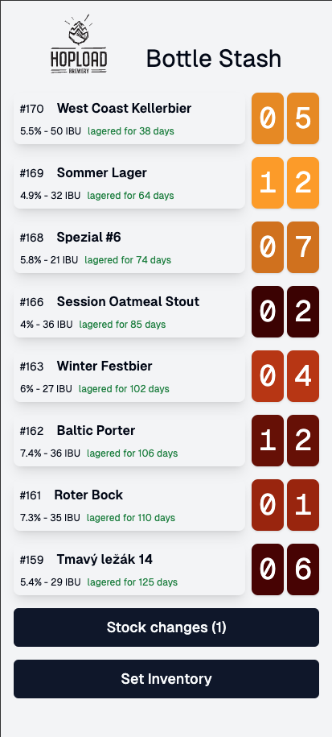

# Beer Stock

App to keep track of beer bottles left. Click Set Inventory to change initial stock. Only beer in "Completed" state are displayed. Click on each beer to decrease stock, confirm or discard with the dialog from the "Stock changes" button.



## Running

Environment:

```bash
BREWFATHER_API_KEY=
BREWFATHER_USER_ID=
CLERK_SECRET_KEY=
NEXT_PUBLIC_CLERK_PUBLISHABLE_KEY=
KV_REST_API_READ_ONLY_TOKEN=
KV_REST_API_TOKEN=
KV_REST_API_URL=
KV_URL=
```

This app uses

* Brewfather as the source for the beer data
* Clerk to lock access to the app
* Vercel KV to store stock

If you want to run this, fork this, deploy on Vercel, add Brewfather API Key, Vercel KV and Clerk for Auth.
